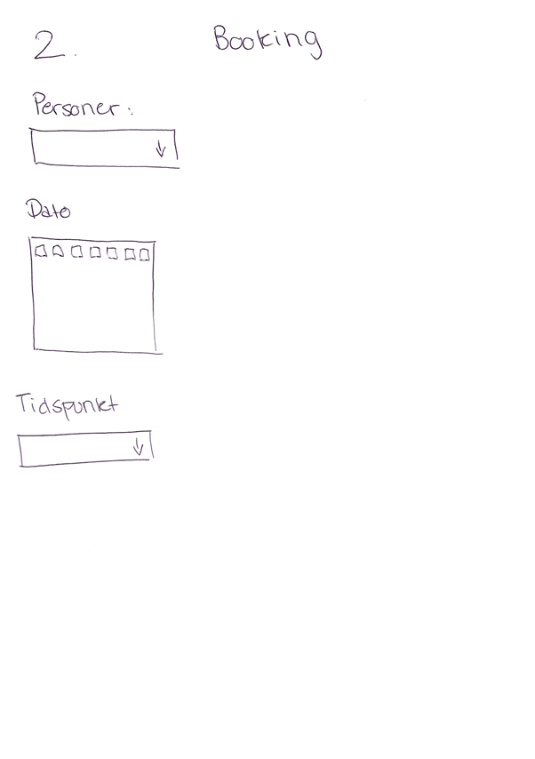
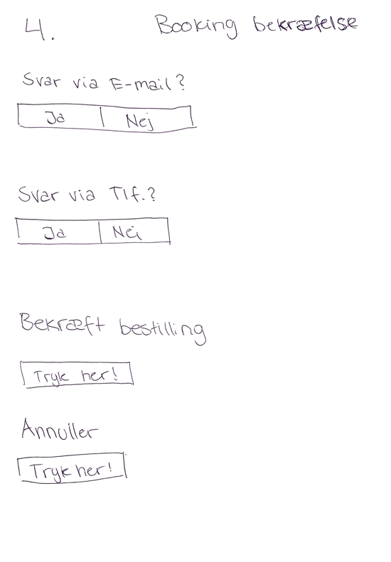

# Gruppe-projekt
Studiegruppe-9 Første aflevering
Bookingsystem - Cafe Bomhuset

Indledning
Vi har i vores gruppe valgt, at udforme et funktionelt bookingsystem. Vores bookingsystem vil udelukkende være tilgængeligt for Café Bomhuset. Vores booking system vil derfor ikke tilpasse sig andre restauranter/caféer, som de fleste andre eksisterende bookingsystemer gør. Vi valgte at ville programmere et bookingsystem, på baggrund af kompleksiteten samt de mange features der kan tilkobles til dette program. Formålet med netop dette booking system er primært, at det skal gøres nemt og simpelt for brugeren, at få booket et bord på restauranten. Valget blev altså et bord booking system gennem en fælles beslutning mellem gruppemedlemmerne.

Beskrivelse
Vores projekt udformes som et bord booking system for Cafe Bomhuset. Systemet gør det muligt for brugeren at booke, annullere samt overvære forhenværende såvel som fremtidige bookinger. Systemet kræver at man først opretter sig som bruger, og man vil derfor på startsiden have at oprette sig som ny bruger, eller hvis allerede oprettet kunne logge sig ind. Når brugeren er logget ind, vil det være muligt for brugeren at indtaste antal personer, dato og tidspunkt. På baggrund af disse informationer vil brugeren blive henvist til en ny side. På denne side vil brugeren kunne se restaurantens borde samt deres visuelle placering. Man kan dernæst se hvilke borde der er ledige den pågældende dag via farver, og udfra det kunne booke det bord man nu måtte ønske, dette er dog ikke et krav. Brugeren kan vælge at restauranten selv udvælger bord pladsen. Sidst vil brugeren blive bedt om, at vælge modtagelse af bookingbekræftelse via enten mail eller telefonnummer, hvorefter det vil være muligt enten at bekræfte, eller annullere den pågældende booking. Bookingen vil ved bekræftelse efterfølgende kunne ses i brugerens booking historik, og det vil herinde også være muligt at annullere bookingen hvis det skulle ønskes.        

Kravspecifikation

Aktører: 

Brugeren (Gæsten) 

Administrator 
- Brugeren

Skal kunne oprette sig som bruger via email, tlf, navn, kodeord. 

Skal fremover kunne logge ind via email og kodeord.

Skal kunne vælge antal personer, dato og tidspunkt.

Skal kunne vælge bord. 

Skal kunne bekræfte booking. 

Skal kunne vælge bekræftelse via email eller tlf. 

Skal kunne se sin booking i booking historikken. 

Skal kunne annullere sin bordbooking

- Administrator

Skal kunne logge ind.

Skal kunne se en oversigt over bookinger.

Skal kunne administrere bookinger (flytte, annullere osv.)

Skal kunne kontakte/kommunikere med brugeren vedrørende bookinger. 

Sketches af skærmbilleder:

Alle objekter og funktionaliteter i punktform

Brugeren

Navn 

Email

Telefonnummer

Kodeord

Evt. login via Facebook

Opret

Login

Email

Kodeord

Login

Overblik over borde - optagede, ledige og dit valg

Valg af bord som ønskes booket

Booking 

Valg af dato

Valg af tidspunkt

Tidsinterval - bookingen strækker sig over 2 timer

Bekræft eller annuller

Afbestilling

Bookingoversigt

Valg af booking

Bekræft eller annuller

Bestillingshistorik

Oversigt over forrige og fremtidige bookinger

Booking bekræftelse 

Bekræftelse via email

Bekræftelse via SMS

Restaurant

Navn

Adresse

Ledigt eller optaget

Administrativ bruger

Oversigt over bookinger

Rediger eller/og besvarelse

